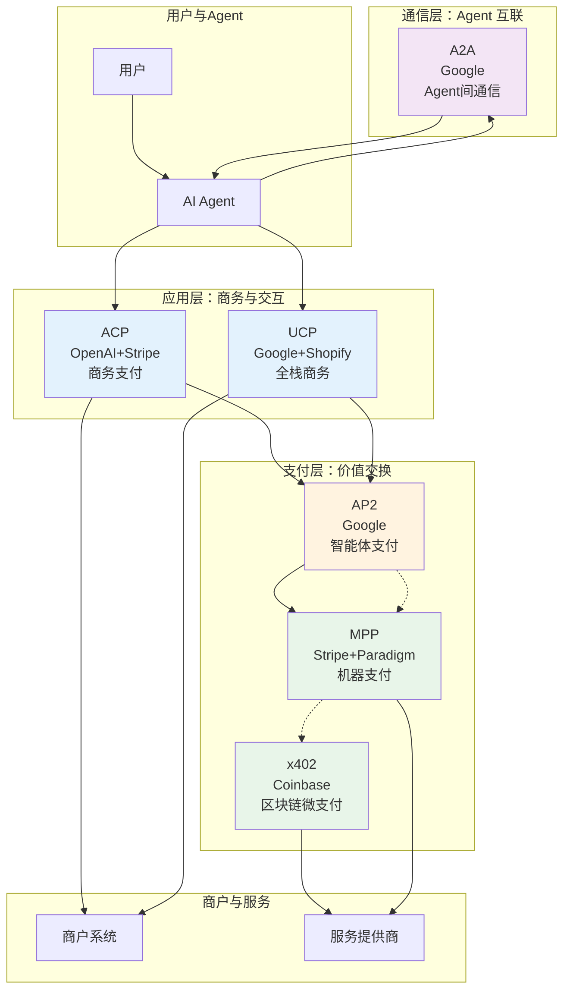
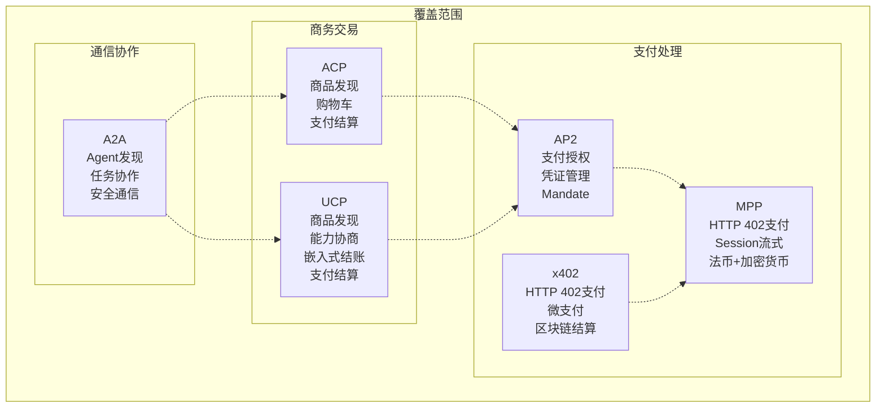
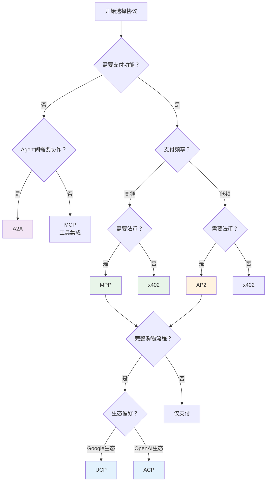

# Agent Protocols 全景概览

> **核心关注协议**：A2A、UCP、AP2、ACP、x402、MPP  
> **分析维度**：协议定位、覆盖范围、核心差异、适用场景

---

## 一、协议定位矩阵

### 1.1 六大协议基本信息

| 协议 | 全称 | 主导方 | 核心定位 | 协议层级 |
|------|------|--------|----------|----------|
| **A2A** | Agent2Agent Protocol | Google | 智能体间通信协议 | 通信层 |
| **UCP** | Universal Commerce Protocol | Google + Shopify | 全栈商务协议 | 应用层 |
| **AP2** | Agent Payments Protocol | Google | 智能体支付协议 | 支付层 |
| **ACP** | Agent Commerce Protocol | OpenAI + Stripe | 商务支付协议 | 应用层 |
| **x402** | x402 Payment Protocol | Coinbase | 区块链微支付协议 | 支付层 |
| **MPP** | Machine Payments Protocol | Stripe + Paradigm | 机器支付协议 | 支付层 |

### 1.2 一句话定位

| 协议 | 核心使命 |
|------|----------|
| **A2A** | 让不同厂商的 AI Agent 能够互相发现和协作 |
| **UCP** | 构建 AI 时代的开放商务基础设施，连接用户-Agent-商户 |
| **AP2** | 为智能体提供标准化的支付授权和凭证管理机制 |
| **ACP** | 让 AI Agent 能够代表用户完成安全的商务交易 |
| **x402** | 用 HTTP 402 状态码实现互联网原生的微支付 |
| **MPP** | 基于 HTTP 402 构建机器对机器的通用支付层，支持法币+加密货币 |

---

## 二、协议覆盖范围关系图

### 2.1 全景架构图



### 2.2 协议覆盖范围对比



---

## 三、协议关系与依赖

### 3.1 分层关系

| 层级 | 协议 | 功能 | 下层依赖 |
|------|------|------|----------|
| **应用层** | ACP、UCP | 商务场景（购物、下单） | 支付层 |
| **通信层** | A2A | Agent 发现与协作 | 传输层 |
| **支付层** | AP2、x402、MPP | 价值交换与结算 | 金融网络 |

### 3.2 协作关系

```
典型购物流程中的协议协作：

用户 -> Agent
    ↓ [A2A] Agent 发现商户 Agent
商户 Agent
    ↓ [UCP/ACP] 商品发现、购物车构建
购物车确认
    ↓ [AP2] 支付授权、Mandate 生成
支付凭证
    ↓ [MPP/x402] 实际支付结算
支付完成
```

---

## 四、核心协议差异分析

### 4.1 商务协议对比：A2A vs UCP vs AP2 vs ACP

| 对比维度 | A2A | UCP | AP2 | ACP |
|----------|-----|-----|-----|-----|
| **核心问题** | Agent 如何互相发现和协作 | 如何构建开放的 AI 商务生态 | 智能体如何安全地支付 | AI 如何代表用户完成购物 |
| **架构模式** | 客户端-服务器 | Server-Select（服务器选择） | 凭证模型（Mandate） | 四方模型（买家-Agent-商家-PSP） |
| **主导方** | Google | Google + Shopify | Google | OpenAI + Stripe |
| **开放程度** | 开放标准 | 开放标准 | 开放标准 | 开放标准（但有 OpenAI 生态倾向） |
| **关键创新** | Agent 能力发现协议 | 能力协商 + 嵌入式结账 | Mandate 授权机制 | 结构化购物车 + 支付集成 |
| **与支付关系** | 不涉及支付 | 集成支付（不指定具体协议） | 专注支付 | 依赖 ACP 支付或外部 PSP |
| **适用场景** | 多 Agent 协作任务 | AI 购物、智能商务 | 机器经济、自动支付 | AI 代购、智能推荐购买 |

#### 4.1.1 关键差异详解

**A2A vs UCP**：
- A2A 专注**Agent 间通信**，解决"Agent 如何对话"的问题
- UCP 专注**商务流程**，解决"如何完成一次购物"的问题
- **关系**：A2A 可以作为 UCP 的底层通信机制

**UCP vs ACP**：
- 两者都覆盖**AI 购物**场景，但哲学不同
- UCP：去中心化，商家自主托管能力描述（类似 Web）
- ACP：中心化目录，商家向平台注册（类似 App Store）
- **关系**：竞争关系，可能长期共存

**AP2 vs ACP/UCP**：
- AP2 专注**支付授权**，是 ACP/UCP 的底层依赖
- ACP/UCP 定义购物流程，AP2 定义支付如何完成
- **关系**：AP2 可以被 UCP/ACP 集成作为支付方式

### 4.2 支付协议对比：x402 vs MPP

| 对比维度 | x402 | MPP |
|----------|------|-----|
| **核心问题** | 如何实现互联网原生的微支付 | 如何构建机器对机器的通用支付层 |
| **技术基础** | HTTP 402 状态码 | HTTP 402 状态码 |
| **支付模式** | Per-request（每笔请求单独支付） | Session-based（批量流式支付） |
| **结算方式** | 纯加密货币（区块链） | 法币（Stripe）+ 加密货币（Tempo） |
| **主导方** | Coinbase | Stripe + Paradigm |
| **关键创新** | 最简单的 HTTP 支付挑战 | Session 流式 + 双轨结算 |
| **性能特点** | 高延迟（区块链确认） | 低延迟（Session 内免确认） |
| **适用场景** | API 按次计费、微支付 | AI Agent 高频调用、M2M  commerce |

#### 4.2.1 关键差异详解

**相同点**：
- 都基于 **HTTP 402** 状态码，利用标准 HTTP 机制
- 都面向**机器支付**场景，无需人工确认
- 都使用**加密凭证**进行支付授权

**核心差异**：

| 场景 | x402 | MPP |
|------|------|-----|
| **支付频率** | 低频（每笔单独结算） | 高频（Session 内批量） |
| **延迟要求** | 可接受秒级延迟 | 需要毫秒级响应 |
| **成本结构** | 每笔上链 Gas 费 | Session 结束统一结算 |
| **货币类型** | 仅加密货币 | 法币 + 加密货币 |
| **使用体验** | 类似"投币使用" | 类似"预付费卡" |

**选择建议**：
- **x402**：适合区块链原生应用、去中心化场景、小额高频但单笔价值低的场景
- **MPP**：适合企业级应用、需要法币合规、AI Agent 高频调用的场景

---

## 五、协议选择决策树



---

## 六、关键洞察与趋势

### 6.1 协议分层趋势

```
┌─────────────────────────────────────────┐
│  应用层：UCP、ACP（商务场景）            │
│  → 解决"如何购物"的问题                 │
├─────────────────────────────────────────┤
│  通信层：A2A（Agent互联）                │
│  → 解决"Agent如何对话"的问题            │
├─────────────────────────────────────────┤
│  支付层：AP2、MPP、x402（价值交换）      │
│  → 解决"如何支付"的问题                 │
└─────────────────────────────────────────┘
```

### 6.2 阵营分化

| 阵营 | 协议 | 特点 |
|------|------|------|
| **Google 生态** | A2A、UCP、AP2 | 全面布局，从通信到支付 |
| **Stripe 生态** | ACP、MPP | 支付为核心，商务为延伸 |
| **区块链原生** | x402 | 去中心化，加密货币优先 |

### 6.3 关键趋势

1. **HTTP 402 复兴**：x402 和 MPP 都选择 HTTP 402，预示"互联网原生支付"成为共识
2. **Session-based 胜出**：MPP 的 session 流式设计更适合 AI 高频调用，可能取代 per-request 模式
3. **双轨制成为标配**：法币+加密货币双支持成为支付协议的标配（MPP 领先）
4. **协议分层明确**：通信、商务、支付三层分工逐渐清晰，但边界仍有交叉竞争

---

## 七、快速参考卡片

### 7.1 协议速查表

| 如果你需要... | 选择协议 | 原因 |
|--------------|----------|------|
| 让不同 Agent 协作 | A2A | 标准化 Agent 发现与任务协作 |
| 构建 AI 购物应用 | UCP/ACP | 完整商务流程支持 |
| 实现 AI 自动支付 | AP2 | 标准化支付授权机制 |
| 区块链微支付 | x402 | 最简单的 HTTP 支付 |
| 企业级 M2M 支付 | MPP | Session 流式 + 法币支持 |
| 高频 API 计费 | MPP | 批量结算降低成本 |

### 7.2 协议关系速记

```
A2A = Agent 的"电话系统"（互相联系）
UCP = Agent 的"购物商场"（完整体验）
ACP = Agent 的"代购服务"（OpenAI 生态）
AP2 = Agent 的"钱包"（支付能力）
x402 = Agent 的"投币机"（单次使用）
MPP = Agent 的"预付卡"（批量结算）
```

---

## 参考资源

- [A2A 官方文档](https://github.com/a2aproject/A2A)
- [UCP 官方文档](https://ucp.dev/)
- [AP2 官方文档](https://ap2lab.com/docs/)
- [ACP 官方文档](https://www.agenticcommerce.dev/)
- [x402 官方文档](https://www.x402.org/)
- [MPP GitHub](https://github.com/tempoxyz/mpp-specs)
