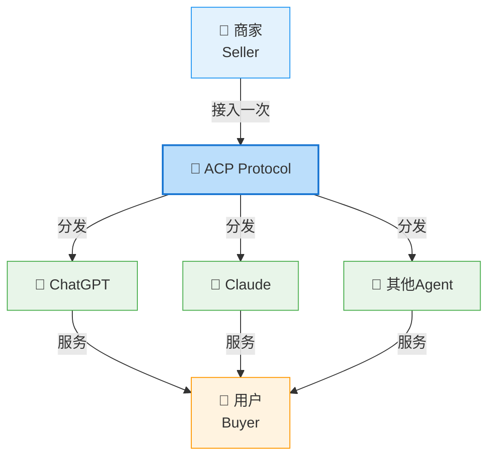
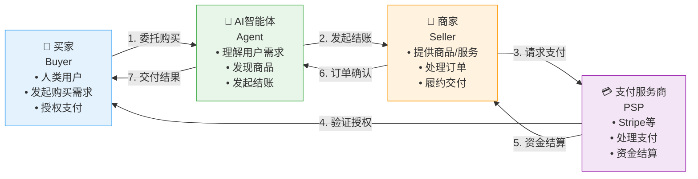
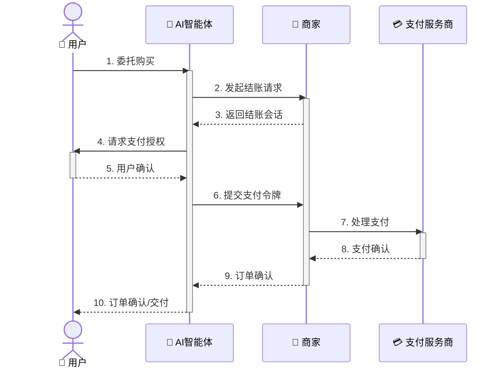

# ACP (Agent Commerce Protocol) 深度调研报告

## 快速入门视频

如果你是第一次了解 ACP，建议先观看以下视频：

| 视频 | 内容 | 时长 |
|------|------|------|
| [Agentic Commerce: The ACP Protocol With Stripe](https://www.youtube.com/watch?v=8zKSbeeCGPw) | ACP 协议完整介绍 | 15分钟 |
| [Implementing ACP with Stripe](https://www.youtube.com/watch?v=l7r9jW2nEOI) | 技术实现教程 | 20分钟 |
| [Buy it in ChatGPT - OpenAI官方演示](https://openai.com/index/buy-it-in-chatgpt/) | 实际购物场景演示 | 5分钟 |

---

## 概述

**Agent Commerce Protocol (ACP)** 是由 **OpenAI** 和 **Stripe** 联合开发的开放标准协议，旨在为AI智能体商务提供标准化的支付和交易框架。ACP让AI智能体能够代表用户完成商品和服务的购买，实现"程序化商务流程"。

> **发布时间**: 2025年初  
> **主要推动方**: OpenAI、Stripe  
> **协议类型**: 商务/支付协议  
> **开源状态**: 完全开源

---

## 核心愿景

ACP的核心理念是**"Build once, distribute everywhere"** —— 商家只需接入一次ACP，就可以将商品和服务分发到任何兼容ACP的AI智能体平台。

---

## 协议角色

ACP 定义了清晰的四方参与模型：

### 角色总览

### 各角色详细说明

| 角色 | 英文 | 核心职责 | 典型代表 |
|------|------|---------|---------|
| **买家** | Buyer | 表达购买意图、授权支付、接收商品 | 终端用户 |
| **AI智能体** | Agent | 理解需求、商品发现、协商价格、发起交易 | ChatGPT、Claude、专用购物Agent |
| **商家** | Seller | 商品信息管理、库存同步、订单处理、物流配送 | Shopify商家、电商平台 |
| **支付服务商** | PSP | 处理支付授权、资金结算、风控管理 | Stripe、其他支付网关 |

---

## 工作流程

### 标准购买流程

---

## 参考资源

- [OpenAI Commerce Documentation](https://developers.openai.com/commerce/)
- [Stripe Agentic Commerce Blog](https://stripe.com/blog/developing-an-open-standard-for-agentic-commerce)

---

*报告生成时间: 2026年3月*
