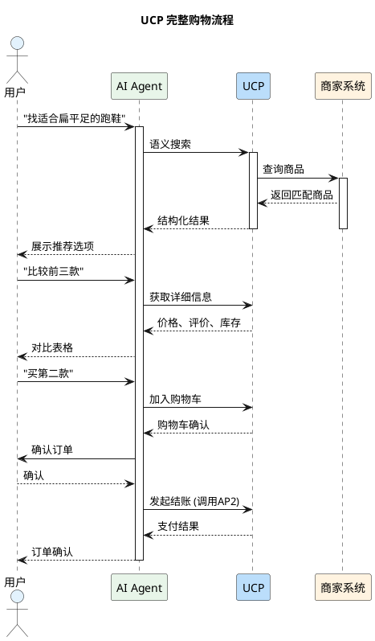
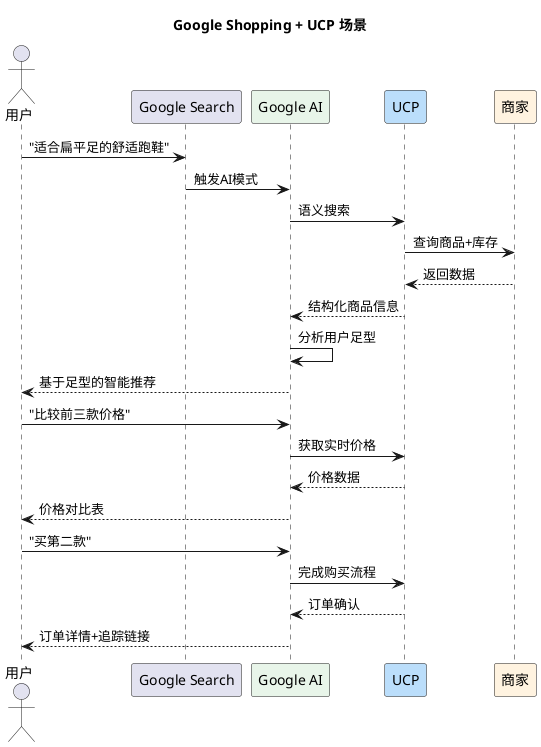
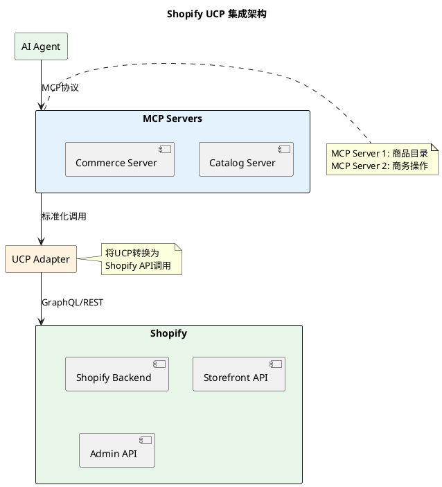

# UCP (Universal Commerce Protocol) 深度调研报告

## 快速入门视频

如果你是第一次了解 UCP，建议先观看以下视频：

| 视频 | 内容 | 时长 |
|------|------|------|
| [Google's New Universal Commerce Protocol](https://www.youtube.com/watch?v=yDKpF6CjBUo) | UCP 协议完整介绍 | 12分钟 |
| [UCP is Live in Google AI Mode](https://www.retailgentic.com/p/alert-ucp-is-live-in-google-ai-mode) | 实际演示与细节 | 10分钟 |
| [How To Enable UCP in Google Merchant Center](https://support.google.com/merchants/community-video/409627242/) | 商家接入教程 | 8分钟 |

---

## 概述

**Universal Commerce Protocol (UCP)** 是由 **Google** 推出的开放标准协议，旨在让AI智能体能够无缝地与零售商和商家系统进行交互。UCP覆盖了从商品发现到售后服务的完整商务生命周期，是Google在AI商务领域的重要布局。

> **发布时间**: 2025年初  
> **主要推动方**: Google  
> **协议类型**: 全栈商务协议  
> **开源状态**: 完全开源

---

## 核心愿景

UCP的愿景是创建一个**统一的商务基础设施**，让任何AI智能体都能完成完整的购物流程。

```plantuml
@startuml

skinparam backgroundColor #FFFFFF

title UCP 完整商务生命周期


rectangle "发现\nDiscovery" as Discovery #E3F2FD {
    :语义搜索;
    :智能推荐;
}

rectangle "选择\nSelection" as Selection #E8F5E9 {
    :商品对比;
    :价格比较;
    :评价分析;
}

rectangle "购买\nPurchase" as Purchase #FFF3E0 {
    :购物车;
    :结账;
    :支付;
}

rectangle "履约\nFulfillment" as Fulfillment #F3E5F5 {
    :订单追踪;
    :物流管理;
    :配送;
}

rectangle "售后\nPost-sales" as PostSales #FFEBEE {
    :退换货;
    :客户服务;
    :评价反馈;
}

Discovery --> Selection
Selection --> Purchase
Purchase --> Fulfillment
Fulfillment --> PostSales

@enduml
```

---

## 协议角色

UCP 定义了多方参与的生态系统，每个角色都有明确的职责：

### 角色总览

```plantuml
@startuml

skinparam backgroundColor #FFFFFF
skinparam rectangle {
    BackgroundColor<<User>> #E3F2FD
    BackgroundColor<<Agent>> #E8F5E9
    BackgroundColor<<Merchant>> #FFF3E0
    BackgroundColor<<Platform>> #F3E5F5
}

title UCP 生态系统角色

rectangle "用户\n(User)" as User <<User>> {
    :表达购物需求;
    :确认购买决策;
    :接收商品/服务;
}

rectangle "AI智能体\n(AI Agent)" as Agent <<Agent>> {
    :理解自然语言需求;
    :语义搜索商品;
    :比较选择;
    :完成交易;
    :追踪订单;
}

rectangle "商家/零售商\n(Merchant)" as Merchant <<Merchant>> {
    :提供商品数据;
    :管理库存;
    :处理订单;
    :履行交付;
}

rectangle "Google平台\n(Google Platform)" as Platform <<Platform>> {
    :Google Shopping;
    :Google Search;
    :Google Assistant;
    :Merchant Center;
}

User --> Agent : 委托购物
Agent --> Platform : 调用UCP接口
Platform --> Merchant : 获取商品数据
Merchant --> Platform : 返回实时信息
Platform --> Agent : 结构化结果
Agent --> User : 展示选项/完成购买

@enduml
```

### 各角色详细说明

| 角色 | 英文 | 核心职责 | 典型代表 |
|------|------|---------|---------|
| **用户** | User | 表达购物需求、确认购买、接收商品 | 终端消费者 |
| **AI智能体** | AI Agent | 语义理解、商品发现、比价、下单、售后 | Google Assistant、第三方Agent |
| **商家** | Merchant | 商品信息管理、库存同步、订单处理、物流配送 | 零售商、品牌官网、电商平台 |
| **平台** | Platform | 提供UCP基础设施、身份验证、数据聚合 | Google Shopping、Merchant Center |

---

## 核心功能

### 1. 三层架构设计

UCP采用创新的三层架构，提供灵活性和可扩展性：

```plantuml
@startuml

skinparam backgroundColor #FFFFFF

title UCP 三层架构

component "第一层: Capabilities (能力层)" as Layer1 #E3F2FD {
    portin "Product Discovery" as PD
    portin "Product Details" as PDet
    portin "Cart Management" as Cart
    portin "Checkout" as Checkout
    portin "Order Management" as OM
}

component "第二层: Extensions (扩展层)" as Layer2 #E8F5E9 {
    :商家自定义功能;
    :行业特定扩展;
    :地区化适配;
}

component "第三层: Services (服务层)" as Layer3 #FFF3E0 {
    :Identity Service;
    :Payment Service (AP2);
    :Inventory Service;
    :Fulfillment Service;
}

Layer1 --> Layer2
Layer2 --> Layer3

note right of Layer1
  核心商务能力
  标准化接口
end note

note right of Layer2
  可扩展点
  定制化能力
end note

note right of Layer3
  基础设施服务
  与AP2集成
end note

@enduml
```

### 2. 核心能力详解

| 能力 | 功能描述 | 技术实现 |
|------|---------|---------|
| **Product Discovery** | 语义搜索、智能推荐 | 自然语言处理、向量搜索 |
| **Product Details** | 商品信息、变体、库存 | 结构化数据、实时同步 |
| **Cart Management** | 购物车操作、优惠计算 | 状态管理、规则引擎 |
| **Checkout** | 安全结账、支付处理 | AP2协议集成、加密传输 |
| **Order Management** | 订单追踪、状态更新 | Webhook、事件驱动 |

### 3. 与AP2的集成

UCP与Google的 **Agent Payments Protocol (AP2)** 紧密配合：

```plantuml
@startuml

skinparam backgroundColor #FFFFFF

title UCP + AP2 集成架构

rectangle "AI Agent" as Agent #E8F5E9

rectangle "UCP (商务层)" as UCP #E3F2FD {
    :Product Discovery;
    :Product Details;
    :Cart Management;
    :Order Management;
}

rectangle "AP2 (支付层)" as AP2 #FFF3E0 {
    :Mandate管理;
    :支付授权;
    :凭证管理;
    :结算处理;
}

rectangle "Payment Network" as Payment #F3E5F5 {
    :银行卡;
    :数字钱包;
    :其他支付方式;
}

Agent --> UCP : 发现商品/管理购物车
UCP --> AP2 : 调用支付 (结账时)
AP2 --> Payment : 资金结算

note right of UCP
  商务逻辑层
  商品生命周期管理
end note

note right of AP2
  支付逻辑层
  安全授权管理
end note

@enduml
```

---

## 技术架构

### 协议规范

```yaml
# UCP 协议规范概览
protocol: Universal Commerce Protocol
version: "1.0"
transport: HTTPS/JSON
authentication: OAuth 2.0 + JWT

# 核心端点
endpoints:
  discovery:
    - /v1/products/search      # 商品搜索
    - /v1/products/{id}        # 商品详情
    - /v1/categories           # 类目浏览
  
  commerce:
    - /v1/cart                 # 购物车管理
    - /v1/checkout             # 结账
    - /v1/orders               # 订单管理
  
  identity:
    - /v1/auth/token           # 身份验证
    - /v1/user/profile         # 用户资料
```

### 数据模型

```json
{
  "product": {
    "id": "string",
    "name": "string",
    "description": "string",
    "price": {
      "amount": "number",
      "currency": "string"
    },
    "variants": [...],
    "availability": "IN_STOCK | OUT_OF_STOCK",
    "merchant": {...}
  },
  
  "cart": {
    "id": "string",
    "items": [...],
    "total": {...},
    "checkout_url": "string"
  },
  
  "order": {
    "id": "string",
    "status": "PENDING | CONFIRMED | SHIPPED | DELIVERED",
    "items": [...],
    "tracking": {...}
  }
}
```

---

## 工作流程

### 完整购物流程



---

## 与ACP的对比

| 维度 | UCP | ACP |
|------|-----|-----|
| **主要推动方** | Google | OpenAI + Stripe |
| **核心关注点** | 完整商务生命周期 | 结账和支付处理 |
| **覆盖范围** | 发现→购买→售后 | 支付环节 |
| **架构风格** | 三层架构(能力/扩展/服务) | REST API |
| **最佳场景** | 复杂商务工作流、语义搜索 | 快速商家接入、安全支付 |
| **身份管理** | 内置身份验证 | 通过PSP处理 |

---

## 实际应用案例

### 案例1: Google Shopping AI

Google将UCP集成到Google Shopping中：



### 案例2: Shopify UCP集成

Shopify通过两个MCP服务器暴露商务原子能力：



---

## 优势与挑战

### 优势

1. **完整的商务覆盖**: 从发现到售后的全流程支持
2. **强大的搜索能力**: 基于Google的语义搜索技术
3. **开放生态**: 与AP2、MCP等协议协同工作
4. **商家友好**: 支持现有零售基础设施

### 挑战

1. **生态竞争**: 面临ACP等协议的竞争
2. **复杂度较高**: 三层架构对小型商家可能过于复杂
3. **依赖Google生态**: 深度整合Google服务

---

## 未来展望

UCP作为Google在AI商务领域的核心协议，预计将：

- **成为AI商务的基础设施**: 连接全球零售商和AI平台
- **推动智能购物普及**: 让AI购物成为主流消费方式
- **促进协议互操作**: 与ACP等协议实现互通

---

## 参考资源

### 官方文档
- [Google UCP Developer Guide](https://developers.google.com/merchant/ucp)
- [UCP Official Website](https://ucp.dev/)

### 视频教程
- [Google's New Universal Commerce Protocol](https://www.youtube.com/watch?v=yDKpF6CjBUo)
- [UCP is Live in Google AI Mode](https://www.retailgentic.com/p/alert-ucp-is-live-in-google-ai-mode)
- [How To Enable UCP](https://support.google.com/merchants/community-video/409627242/)

---

*报告生成时间: 2026年3月*  
*研究员: AI Research Assistant*
