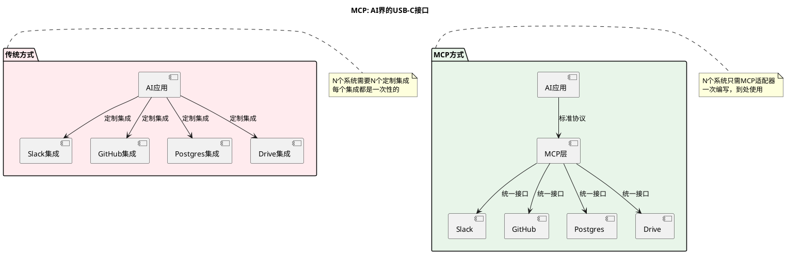
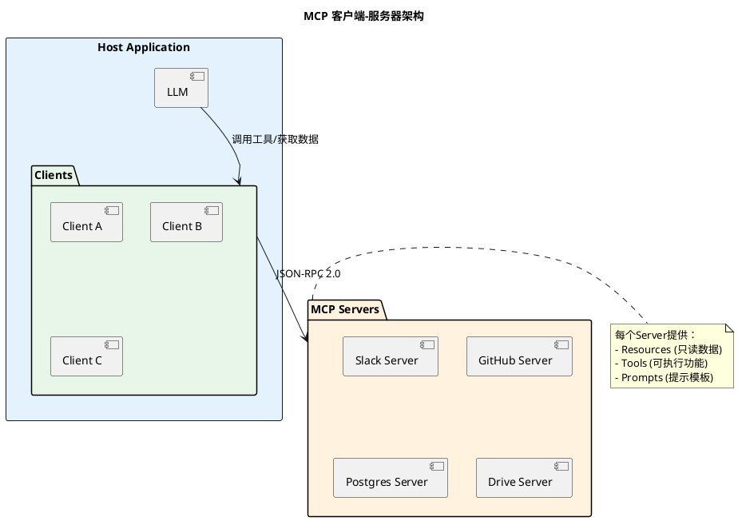
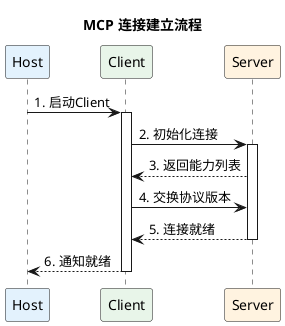
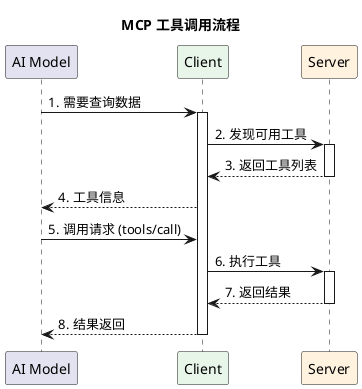
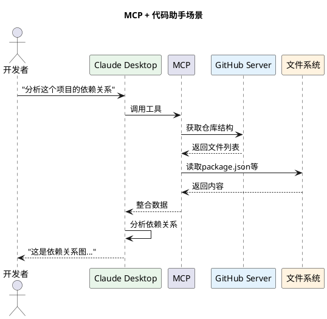
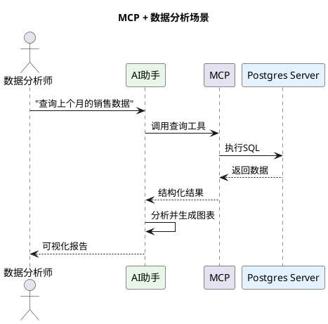

# MCP (Model Context Protocol) 深度调研报告

## 快速入门视频

如果你是第一次了解 MCP，建议先观看以下视频：

| 视频 | 内容 | 时长 |
|------|------|------|
| [The Model Context Protocol (MCP)](https://www.youtube.com/watch?v=CQywdSdi5iA) | MCP 协议完整介绍 | 10分钟 |
| [How To Use Anthropic's MCP](https://www.youtube.com/watch?v=KiNyvT02HJM) | 实战使用教程 | 18分钟 |
| [MCP Course with Anthropic](https://www.deeplearning.ai/short-courses/mcp-build-rich-context-ai-apps-with-anthropic/) | 官方完整课程 | 2小时 |

---

## 概述

**Model Context Protocol (MCP)** 是由 **Anthropic** 推出的开放标准协议，旨在为AI模型与外部数据源、工具之间提供标准化的连接方式。MCP被称为**"AI界的USB-C接口"**，它统一了AI应用与各种外部系统集成的标准。

> **发布时间**: 2024年11月  
> **主要推动方**: Anthropic (Claude的开发者)  
> **协议类型**: 上下文/工具集成协议  
> **开源状态**: 完全开源，已捐赠给Agentic AI Foundation

---

## 核心愿景

MCP的愿景是**消除AI集成的碎片化**，通过单一协议连接AI与所有外部系统。



---

## 协议角色

MCP 定义了三个核心角色，形成客户端-服务器架构：

### 角色总览

```plantuml
@startuml

skinparam backgroundColor #FFFFFF
skinparam rectangle {
    BackgroundColor<<Host>> #E3F2FD
    BackgroundColor<<Client>> #E8F5E9
    BackgroundColor<<Server>> #FFF3E0
}

title MCP 架构角色

rectangle "Host (宿主)" as Host <<Host>> {
    :AI应用程序;
    :如 Claude Desktop、IDE;
    :承载LLM和多个Client;
}

rectangle "Client (客户端)" as Client <<Client>> {
    :连接管理器;
    :维护与Server的连接;
    :协议转换;
}

rectangle "Server (服务端)" as Server <<Server>> {
    :数据/工具提供者;
    :暴露资源和能力;
    :如 Slack、GitHub、DB;
}

Host --> Client : 内部包含
Client --> Server : MCP协议连接

note right of Host
  可以是：
  - Claude Desktop
  - Cursor IDE
  - 自定义AI应用
end note

note right of Server
  提供：
  - Resources (数据)
  - Tools (功能)
  - Prompts (模板)
end note

@enduml
```

### 各角色详细说明

| 角色 | 英文 | 核心职责 | 典型代表 |
|------|------|---------|---------|
| **Host** | Host | 承载AI模型、管理Client连接、提供用户界面 | Claude Desktop、IDE、AI应用 |
| **Client** | Client | 维护Server连接、处理协议通信、能力协商 | Host内置的连接器 |
| **Server** | Server | 暴露数据资源、提供工具功能、定义提示模板 | 各种MCP Server |

---

## 核心架构

### 客户端-服务器模型



### Server提供的功能

MCP Server可以向Client提供三种核心功能：

```plantuml
@startuml

skinparam backgroundColor #FFFFFF

title MCP Server 功能类型

rectangle "MCP Server" as Server #FFF3E0

rectangle "Resources (资源)" as Resources #E3F2FD {
    :文件内容;
    :数据库记录;
    :API响应;
    :实时数据;
}

rectangle "Tools (工具)" as Tools #E8F5E9 {
    :执行函数;
    :调用API;
    :运行代码;
    :修改状态;
}

rectangle "Prompts (提示)" as Prompts #FFF8E1 {
    :预设提示;
    :工作流模板;
    :上下文注入;
}

Server --> Resources : 提供
Server --> Tools : 提供
Server --> Prompts : 提供

note right of Resources
  用途：为AI提供上下文数据
  特点：只读，被动获取
end note

note right of Tools
  用途：让AI执行操作
  特点：可执行，需用户确认
end note

note right of Prompts
  用途：引导用户交互
  特点：模板化，可复用
end note

@enduml
```

---

## 核心功能

### Client提供的功能

Client也可以向Server提供功能，实现双向交互：

| 功能 | 描述 | 用途 |
|------|------|------|
| **Sampling** | 服务器发起的LLM调用 | Server可以请求AI生成内容 |
| **Roots** | 服务器发起的根URI查询 | Server可以了解可操作范围 |
| **Elicitation** | 服务器向用户请求额外信息 | 动态获取必要输入 |

---

## 技术规范

### 通信协议

MCP基于JSON-RPC 2.0进行通信：

```json
// 请求示例
{
  "jsonrpc": "2.0",
  "id": 1,
  "method": "tools/call",
  "params": {
    "name": "query_database",
    "arguments": {
      "sql": "SELECT * FROM users WHERE id = 123"
    }
  }
}

// 响应示例
{
  "jsonrpc": "2.0",
  "id": 1,
  "result": {
    "content": [
      {
        "type": "text",
        "text": "{\"id\": 123, \"name\": \"张三\"}"
      }
    ]
  }
}
```

### 传输方式

```plantuml
@startuml

skinparam backgroundColor #FFFFFF

title MCP 传输方式

package "本地传输 (Local)" as Local #E8F5E9 {
    :stdio (标准输入输出);
    :本地Socket;
    :进程间通信;
}

package "远程传输 (Remote)" as Remote #E3F2FD {
    :HTTP/SSE;
    :WebSocket;
}

Local --> [适用场景] : Claude Desktop
Local --> [适用场景] : 本地开发工具
Remote --> [适用场景] : 远程服务
Remote --> [适用场景] : 云服务

@enduml
```

---

## 工作流程

### 连接建立流程



### 工具调用流程



---

## 实际应用场景

### 场景1: 代码助手



### 场景2: 数据分析



---

## MCP生态

### 官方Server示例

| Server | 功能 | 用途 |
|--------|------|------|
| **filesystem** | 文件系统访问 | 读写本地文件 |
| **postgres** | PostgreSQL数据库 | SQL查询和操作 |
| **sqlite** | SQLite数据库 | 轻量级数据存储 |
| **github** | GitHub集成 | 代码仓库操作 |
| **slack** | Slack集成 | 消息和频道管理 |
| **google-drive** | Google Drive | 文档管理 |
| **puppeteer** | 浏览器自动化 | 网页抓取和测试 |
| **fetch** | HTTP请求 | 调用外部API |

### 社区Server

社区已经开发了数百个MCP Server，覆盖：

- **数据库**: MySQL、MongoDB、Redis
- **云服务**: AWS、Azure、GCP
- **开发工具**: Docker、Kubernetes、Git
- **协作工具**: Notion、Trello、Asana
- **社交媒体**: Twitter、Discord、Telegram

---

## 与其他协议的关系

### MCP vs ACP vs A2A

```plantuml
@startuml

skinparam backgroundColor #FFFFFF

title 智能体协议分工

rectangle "AI智能体层" as AI #F5F5F5 {
    [Claude]
    [ChatGPT]
    [Gemini]
}

package "协议层" as Protocols {
    rectangle "MCP" as MCP #E3F2FD {
        :工具集成;
        :数据访问;
    }
    
    rectangle "A2A" as A2A #E8F5E9 {
        :智能体间通信;
        :任务协作;
    }
    
    rectangle "ACP" as ACP #FFF3E0 {
        :商务支付;
        :订单管理;
    }
}

rectangle "外部世界" as External #F5F5F5 {
    [工具/服务]
    [商家系统]
}

AI --> MCP : 使用工具
AI --> A2A : 协作
AI --> ACP : 购物

MCP --> External : 集成
A2A --> External : 通信
ACP --> External : 交易

note right of Protocols
  关系: 互补而非竞争
  共同构建智能体生态
end note

@enduml
```

| 协议 | 核心作用 | 类比 |
|------|---------|------|
| **MCP** | AI与工具的连接 | USB-C接口 |
| **ACP** | AI商务和支付 | 购物车系统 |
| **A2A** | AI智能体之间的通信 | 即时通讯 |

---

## 优势与挑战

### 优势

1. **标准化**: 统一的集成标准，避免重复造轮子
2. **生态丰富**: 快速增长的Server生态系统
3. **安全可控**: 用户明确授权，数据访问可控
4. **灵活扩展**: 支持自定义Server开发
5. **厂商中立**: 不绑定特定AI平台

### 挑战

1. **性能开销**: JSON-RPC通信有一定延迟
2. **学习成本**: 开发者需要学习新协议
3. **版本兼容**: 协议演进需要保持向后兼容
4. **安全审计**: Server代码需要严格审查

---

## 未来展望

MCP作为AI基础设施的重要协议，预计将：

- **成为AI应用标配**: 类似LSP在IDE中的地位
- **推动AI应用爆发**: 降低AI应用开发门槛
- **促进协议融合**: 与ACP、A2A等协议深度整合
- **扩展更多场景**: 从开发工具扩展到更多垂直领域

---

## 参考资源

### 官方文档
- [MCP Official Website](https://modelcontextprotocol.io/)
- [MCP Specification](https://modelcontextprotocol.io/specification/)
- [Anthropic MCP Announcement](https://www.anthropic.com/news/model-context-protocol)

### 视频教程
- [The Model Context Protocol (MCP)](https://www.youtube.com/watch?v=CQywdSdi5iA)
- [How To Use Anthropic's MCP](https://www.youtube.com/watch?v=KiNyvT02HJM)
- [MCP Course with Anthropic](https://www.deeplearning.ai/short-courses/mcp-build-rich-context-ai-apps-with-anthropic/)

---

*报告生成时间: 2026年3月*  
*研究员: AI Research Assistant*
