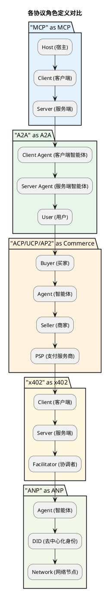
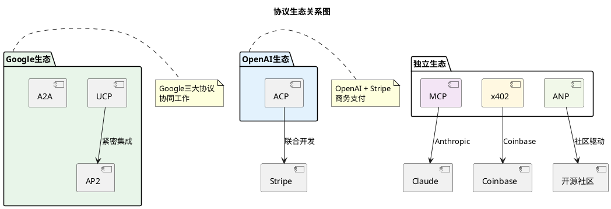
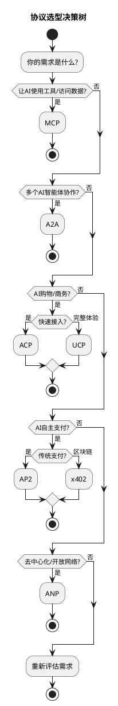

# 智能体协议全景对比分析

## 快速入门视频

如果你是第一次了解智能体协议，建议先观看以下概览视频：

| 视频 | 内容 | 时长 |
|------|------|------|
| [AI Agent Protocols Explained](https://www.youtube.com/watch?v=tb0c70DROYE) | 协议全景介绍 | 12分钟 |
| [MCP/ACP/A2A/ANP对比](https://zhuanlan.zhihu.com/p/1908175325663306451) | 中文深度对比 | 阅读 |
| [Top AI Agent Protocols in 2026](https://getstream.io/blog/ai-agent-protocols/) | 2026年协议趋势 | 阅读 |

---

## 概述

随着AI智能体技术的快速发展，多个协议标准应运而生，各自解决智能体生态中的不同问题。本报告对当前主流的7大智能体协议进行全面对比分析。

---

## 协议总览

```plantuml
@startuml

skinparam backgroundColor #FFFFFF

title 智能体协议全景图

rectangle "AI智能体层" as AI #F5F5F5 {
    [Claude]
    [ChatGPT]
    [Gemini]
    [专用Agent]
}

package "协议层" as Protocols #FFFFFF {
    rectangle "MCP\n(Anthropic)" as MCP #E3F2FD {
        :工具集成;
    }
    
    rectangle "A2A\n(Google)" as A2A #E8F5E9 {
        :智能体通信;
    }
    
    rectangle "ACP\n(OpenAI+Stripe)" as ACP #FFF3E0 {
        :商务支付;
    }
    
    rectangle "UCP\n(Google)" as UCP #F3E5F5 {
        :全栈商务;
    }
    
    rectangle "AP2\n(Google)" as AP2 #E1F5FE {
        :智能体支付;
    }
    
    rectangle "x402\n(Coinbase)" as x402 #FFF8E1 {
        :区块链支付;
    }
    
    rectangle "ANP\n(开源社区)" as ANP #F1F8E9 {
        :去中心化通信;
    }
}

rectangle "外部世界" as External #F5F5F5 {
    [工具/服务]
    [商家系统]
    [区块链]
}

AI --> MCP
AI --> A2A
AI --> ACP
AI --> UCP
AI --> AP2
AI --> x402
AI --> ANP

MCP --> External
A2A --> External
ACP --> External
UCP --> External
AP2 --> External
x402 --> External
ANP --> External

@enduml
```

---

## 协议角色对比

### 各协议的角色定义



### 角色详细对比

| 协议 | 主要角色 | 角色职责 |
|------|---------|---------|
| **MCP** | Host, Client, Server | Host承载AI，Client管理连接，Server提供工具/数据 |
| **A2A** | Client Agent, Server Agent | Client发起请求，Server提供服务，Agent间协作 |
| **ACP** | Buyer, Agent, Seller, PSP | 买家授权，Agent代购，商家供货，PSP处理支付 |
| **UCP** | User, Agent, Merchant, Platform | 用户购物，Agent代理，商家提供商品，平台聚合 |
| **AP2** | Payer, Payee, Facilitator | 付款方，收款方，协调者处理支付流程 |
| **x402** | Client, Server, Facilitator | 客户端请求，服务端提供资源，协调者处理支付 |
| **ANP** | Agent, Network Node | 智能体直接通信，网络节点维护DHT |

---

## 协议对比矩阵

### 基础信息对比

| 协议 | 全称 | 主要推动方 | 发布时间 | 协议类型 | 开源状态 |
|------|------|-----------|---------|---------|---------|
| **MCP** | Model Context Protocol | Anthropic | 2024.11 | 工具集成 | 开源 |
| **A2A** | Agent2Agent Protocol | Google | 2025 | 智能体通信 | 开源 |
| **ACP** | Agent Commerce Protocol | OpenAI + Stripe | 2025 | 商务支付 | 开源 |
| **UCP** | Universal Commerce Protocol | Google | 2025 | 全栈商务 | 开源 |
| **AP2** | Agent Payments Protocol | Google | 2025 | 智能体支付 | 开源 |
| **x402** | x402 Payment Protocol | Coinbase | 2024-2025 | 区块链支付 | 开源 |
| **ANP** | Agent Network Protocol | 开源社区 | 2024-2025 | 去中心化通信 | 开源 |

### 技术架构对比

| 协议 | 架构模式 | 通信协议 | 身份系统 | 传输层 |
|------|---------|---------|---------|--------|
| **MCP** | 客户端-服务器 | JSON-RPC 2.0 | 平台管理 | stdio/HTTP/WebSocket |
| **A2A** | 客户端-服务器 | JSON-RPC 2.0 | OAuth/API Keys | HTTPS |
| **ACP** | 四方模型 | REST API | PSP管理 | HTTPS |
| **UCP** | 三层架构 | REST API | 内置身份 | HTTPS |
| **AP2** | 凭证模型 | REST API | Mandate系统 | HTTPS |
| **x402** | HTTP扩展 | HTTP 402 | 钱包地址 | HTTP/区块链 |
| **ANP** | P2P去中心化 | 自定义 | DID | libp2p/WebSocket |

### 核心功能对比

| 协议 | 主要功能 | 适用场景 | 优势 | 局限 |
|------|---------|---------|------|------|
| **MCP** | 工具集成、数据访问 | AI应用开发 | 标准化、生态丰富 | 仅限工具层 |
| **A2A** | 智能体间通信 | 多智能体协作 | 跨厂商互操作 | 需要广泛采用 |
| **ACP** | 商务支付 | AI购物 | 支付能力强 | 生态局限 |
| **UCP** | 全栈商务 | 智能购物 | 完整生命周期 | 复杂度高 |
| **AP2** | 智能体支付 | 机器经济 | 灵活授权 | 用户教育成本 |
| **x402** | 微支付 | API经济 | 互联网原生 | 区块链延迟 |
| **ANP** | 去中心化通信 | 开放网络 | 自主主权 | 技术门槛 |

---

## 协议关系图谱

### 分层架构视角

```plantuml
@startuml

skinparam backgroundColor #FFFFFF

title 智能体协议分层架构

component "第4层: 应用层" as L4 #E3F2FD {
    :ACP / UCP;
    :商务应用、购物场景;
}

component "第3层: 支付层" as L3 #E8F5E9 {
    :AP2 / x402;
    :支付处理、价值交换;
}

component "第2层: 通信层" as L2 #FFF3E0 {
    :A2A / ANP;
    :智能体间通信、协作;
}

component "第1层: 集成层" as L1 #F3E5F5 {
    :MCP;
    :工具集成、数据访问;
}

component "第0层: 基础设施" as L0 #F5F5F5 {
    :HTTP / HTTPS;
    :WebSocket / libp2p;
    :区块链;
}

L4 --> L3
L3 --> L2
L2 --> L1
L1 --> L0

@enduml
```

### 生态关系图



---

## 选型指南

### 按场景选择



### 按技术栈选择

| 技术偏好 | 推荐协议 | 理由 |
|---------|---------|------|
| **Web2传统** | MCP + ACP | 成熟稳定，生态丰富 |
| **Google生态** | UCP + AP2 + A2A | 深度整合，协同工作 |
| **Web3/区块链** | x402 + ANP | 去中心化，加密原生 |
| **企业应用** | A2A + MCP | 跨厂商协作，工具集成 |
| **开源优先** | ANP + MCP | 社区驱动，无厂商锁定 |

---

## 协议发展趋势

### 融合趋势

```plantuml
@startuml

skinparam backgroundColor #FFFFFF

title 协议融合趋势预测

rectangle "2024-2025: 协议分化期" as Phase1 #FFEBEE {
    :各厂商推出自己的协议;
    :生态各自独立发展;
    :竞争大于合作;
}

rectangle "2025-2026: 协议整合期" as Phase2 #FFF8E1 {
    :协议间桥接方案出现;
    :互补协议开始协作;
    :行业标准开始形成;
}

rectangle "2026+: 协议融合期" as Phase3 #E8F5E9 {
    :统一协议栈形成;
    :分层架构标准化;
    :智能体互联网成熟;
}

Phase1 --> Phase2
Phase2 --> Phase3

@enduml
```

### 预测的未来协议栈

```plantuml
@startuml

skinparam backgroundColor #FFFFFF

title 预测的未来统一协议栈

component "应用层" as App #E3F2FD {
    :统一商务协议;
    :融合 ACP + UCP 最佳实践;
}

component "支付层" as Payment #E8F5E9 {
    :统一支付协议;
    :融合 AP2 + x402 + 传统支付;
}

component "通信层" as Comm #FFF3E0 {
    :统一通信协议;
    :融合 A2A + ANP 核心特性;
}

component "集成层" as Integ #F3E5F5 {
    :MCP (已成为事实标准);
}

App --> Payment
Payment --> Comm
Comm --> Integ

@enduml
```

---

## 对开发者的建议

### 短期策略 (2025)

1. **优先学习MCP** - 已成为工具集成的事实标准
2. **关注A2A** - 多智能体协作的必备技能
3. **根据业务选择支付协议**:
   - 电商场景: ACP 或 UCP
   - API经济: x402
   - 企业应用: AP2

### 中期策略 (2025-2026)

1. **构建协议适配层** - 为未来的协议融合做准备
2. **参与开源社区** - 影响协议发展方向
3. **关注标准组织** - 如W3C、Agentic AI Foundation

### 长期策略 (2026+)

1. **拥抱统一协议栈** - 当行业标准形成时及时迁移
2. **积累协议设计经验** - 为下一代协议做准备
3. **关注跨链/跨协议互操作** - 这是长期需求

---

## 参考资源

### 官方文档

- [MCP Specification](https://modelcontextprotocol.io/specification/)
- [A2A GitHub](https://github.com/a2aproject/A2A)
- [UCP Developer Guide](https://developers.google.com/merchant/ucp)
- [AP2 Documentation](https://ap2lab.com/docs/)
- [x402 Website](https://www.x402.org/)
- [ANP White Paper](https://w3c-cg.github.io/ai-agent-protocol/)

### 视频教程

- [AI Agent Protocols Explained](https://www.youtube.com/watch?v=tb0c70DROYE)
- [MCP/ACP/A2A/ANP对比](https://zhuanlan.zhihu.com/p/1908175325663306451)
- [Top AI Agent Protocols in 2026](https://getstream.io/blog/ai-agent-protocols/)

---

*报告生成时间: 2026年3月*  
*研究员: AI Research Assistant*
