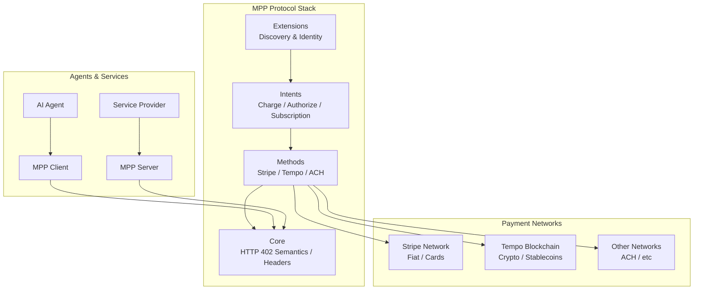
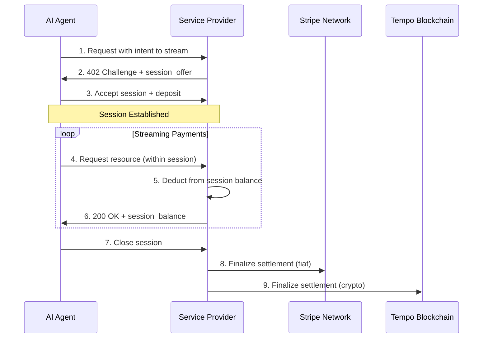

# MPP (Machine Payments Protocol)

> **协议定位**：机器对机器（M2M）支付的互联网原生协议  
> **主导方**：Tempo（Stripe + Paradigm 联合孵化）  
> **核心创新**：基于 HTTP 402 状态码构建，支持法币+加密货币双轨支付

---

## 一句话定位

MPP 是 Stripe 与 Paradigm 联合孵化的 **机器支付协议**，基于 HTTP 402 状态码构建，让 AI Agent 和服务能够以"互联网原生"的方式自主完成支付。它既支持传统法币支付（通过 Stripe），也支持加密货币支付（通过 Tempo 区块链），目标是成为机器对机器（M2M） commerce 的通用支付层。

---

## 架构全景

MPP 采用**"核心 + 扩展"的模块化架构**，将稳定的协议机制与不断演进的支付生态解耦：



**架构核心洞察**：MPP 不是重新发明支付协议，而是**在现有 HTTP 协议之上添加支付语义**，利用标准的 402 状态码和 WWW-Authenticate 头部，让任何支持 HTTP 的服务都能快速接入机器支付能力。

---

## 核心机制详解

### 机制一：基于 HTTP 402 的支付挑战流程

**问题是什么**：
传统支付需要复杂的 SDK 集成、回调处理和状态管理。AI Agent 需要一种**简单、通用、无状态**的方式来发现服务价格并完成支付。

**关键洞察**：
HTTP 协议早已预留了 402 Payment Required 状态码，但从未被广泛使用。MPP 的核心创新是**赋予 402 实际的支付语义**，让服务器可以像返回 404 一样自然地返回"需要付费"。

**具体实现**：

```http
# 1. Agent 请求服务
GET /api/data HTTP/1.1
Host: service.example.com

# 2. 服务器返回 402 挑战
HTTP/1.1 402 Payment Required
WWW-Authenticate: Payment
    mpp_version="1.0"
    mpp_intent="charge"
    mpp_amount="100"
    mpp_currency="USD"
    mpp_methods="stripe,tempo"

# 3. Agent 完成支付后重试
GET /api/data HTTP/1.1
Host: service.example.com
Authorization: Payment
    mpp_version="1.0"
    mpp_receipt="{payment_receipt}"
    mpp_proof="{cryptographic_proof}"

# 4. 服务器验证并返回资源
HTTP/1.1 200 OK
Content-Type: application/json
```

**为什么这样设计能 work**：
- **无状态**：服务器不需要维护会话状态，所有支付信息都在请求头中
- **通用性**：任何 HTTP 客户端都能理解，无需专用 SDK
- **可扩展**：通过 IANA 注册表管理新的 header 字段，协议可以演进
- **安全**： cryptographic proof 确保支付凭证不可伪造和重放

---

### 机制二：Session-based Streaming Payments（流式支付）

**问题是什么**：
AI Agent 可能需要**高频、小额、持续**的支付（如按 token 计费、按 API 调用计费）。传统"单笔交易确认"模式会产生巨大的交互开销。

**关键洞察**：
与其每笔支付都走完整的 402 挑战流程，不如建立一个**支付会话（session）**，在会话内批量处理多笔小额支付，定期结算。

**具体实现**：



**为什么这样设计能 work**：
- **降低延迟**：会话建立后，单次请求无需额外支付确认
- **减少 Gas 费**：加密货币场景下，批量结算大幅降低链上成本
- **灵活计费**：支持按量计费、预付费、后付费等多种模式
- **双轨结算**：同一 session 可以同时结算到法币和加密账户

---

### 机制三：Shared Payment Tokens（共享支付令牌）

**问题是什么**：
Agent 需要在不同服务间使用支付凭证，但直接传递原始卡号或钱包私钥存在严重安全风险。

**关键洞察**：
借鉴传统支付的 tokenization 思想，MPP 引入**共享支付令牌（SPT）**——一种受限的、可验证的、跨服务通用的支付凭证。

**SPT 的核心属性**：

| 属性 | 说明 | 安全意义 |
|------|------|---------|
| **Scoped** | 限定使用范围（特定商户/服务/金额） | 泄露后损失可控 |
| **Time-bound** | 有过期时间 | 短期有效，降低长期风险 |
| **Revocable** | 可随时撤销 | 发现异常可立即失效 |
| **Verifiable** | 密码学可验证 | 无需中心化验证 |
| **Interoperable** | 跨服务通用 | 用户只需一次授权 |

**SPT 在 MPP 中的使用**：

```javascript
// Agent 向 Credential Provider 申请 SPT
const spt = await credentialProvider.issueSPT({
  scope: ["service-a.com", "service-b.com"],
  maxAmount: "1000 USD",
  expiresAt: "2026-04-28T00:00:00Z",
  networks: ["stripe", "tempo"]
});

// 在 MPP 请求中使用 SPT
fetch("https://service-a.com/api", {
  headers: {
    "Authorization": `Payment ${spt.toHeader()}`
  }
});
```

---

## 关键设计决策

### 决策一：HTTP 402 vs 自定义协议

**选择了什么**：
复用 HTTP 402 状态码，基于标准 HTTP 头部扩展。

**显而易见的替代方案**：
像 gRPC 或 GraphQL 那样设计专用的支付协议，或基于 WebSocket 的实时通信协议。

**为什么没选**：
- **普及性**：HTTP 是互联网通用语言，任何服务都能立即支持
- **基础设施兼容**：CDN、负载均衡、防火墙都理解 HTTP
- **无 SDK 依赖**：Agent 不需要安装专用客户端

**Trade-off**：
- HTTP 是无状态的，复杂的支付场景（如订阅管理）需要额外的 session 层
- Header 大小有限制，复杂的支付信息需要额外的 discovery 机制

---

### 决策二：多网络支持（Stripe + Tempo）

**选择了什么**：
协议层抽象，同时支持法币网络（Stripe）和加密货币网络（Tempo）。

**显而易见的替代方案**：
只支持单一网络（如纯 Stripe 或纯以太坊），让市场选择。

**为什么没选**：
- **用户选择**：有些用户偏好法币的稳定性和合规性，有些偏好加密货币的全球化
- **场景适配**：高频小额适合 crypto（低手续费），大额交易适合法币（合规保障）
- **生态整合**：Stripe 提供商户基础设施，Tempo 提供区块链结算，两者互补

**Trade-off**：
- 协议复杂度增加，需要处理不同网络的最终性（finality）差异
- 跨网络结算存在汇率和对冲问题

---

### 决策三：Session-based vs Per-request 支付

**选择了什么**：
支持 session-based streaming payments，批量处理小额支付。

**显而易见的替代方案**：
每笔请求都走完整的 402 挑战-支付-验证流程（类似 x402 的做法）。

**为什么没选**：
- **性能**：AI Agent 可能需要每秒数十次调用，per-request 模式延迟不可接受
- **成本**：加密货币场景下，每笔上链都有 Gas 费，批量结算可降低成本 90%+
- **用户体验**：session 模式让 Agent 可以"先消费后结算"，更符合 AI 自主决策的特性

**Trade-off**：
- 引入了状态管理（session 维护），违背了 HTTP 无状态哲学
- 需要处理 session 异常（如 Agent 突然断开，未结算金额如何处理）

---

## 技术栈与依赖

| 层级 | 技术/标准 | 用途 |
|------|-----------|------|
| **传输** | HTTP/1.1, HTTP/2, HTTP/3 | 基础通信协议 |
| **认证** | HTTP WWW-Authenticate / Authorization | 支付挑战与凭证传递 |
| **加密** | Ed25519, ECDSA | SPT 签名与验证 |
| **法币网络** | Stripe API | 卡支付、银行转账 |
| **加密网络** | Tempo Blockchain | 链上结算、智能合约 |
| **序列化** | JSON, CBOR | 支付信息编码 |

---

## 与现有协议的对比

| 协议 | 主导方 | 核心特点 | 与 MPP 的差异 |
|------|--------|---------|--------------|
| **ACP** | OpenAI + Stripe | 中心化目录，商户注册制 | MPP 更开放，无需中心注册 |
| **UCP** | Google + Shopify | Server-Select 架构，商家自主 | MPP 更简单，基于标准 HTTP |
| **x402** | Coinbase | 纯加密货币，per-request 支付 | MPP 支持法币+session 流式 |
| **ANP** | Anthropic | 专注于 Agent 间协作 | MPP 专注于支付结算 |

**MPP 的差异化定位**：
- **最简单**：基于 HTTP 402，学习成本最低
- **最灵活**：法币+加密货币双轨支持
- **最高频**：session-based 适合 AI 高频调用场景

---

## 关键收获

1. **HTTP 402 的复兴**：MPP 证明了"旧标准新用"的力量——不需要重新发明协议，只需给现有标准赋予实际语义。

2. **Session-based 是 AI 支付的关键**：AI Agent 的高频调用特性决定了 per-request 支付模式不可行，session-based streaming 是更优解。

3. **双轨制是务实选择**：法币和加密货币各有优势，MPP 不站队，让市场选择，这是 Stripe 务实风格的体现。

---

## 参考资源

- [MPP 官方规范](https://github.com/tempoxyz/mpp-specs)
- [Stripe MPP 文档](https://docs.stripe.com/payments/machine/mpp)
- [Stripe 博客：Machine Payments Protocol](https://stripe.com/blog/machine-payments-protocol)
- [Tempo GitHub](https://github.com/tempoxyz)
- [Stripe 示例代码](https://github.com/stripe-samples/machine-payments)
