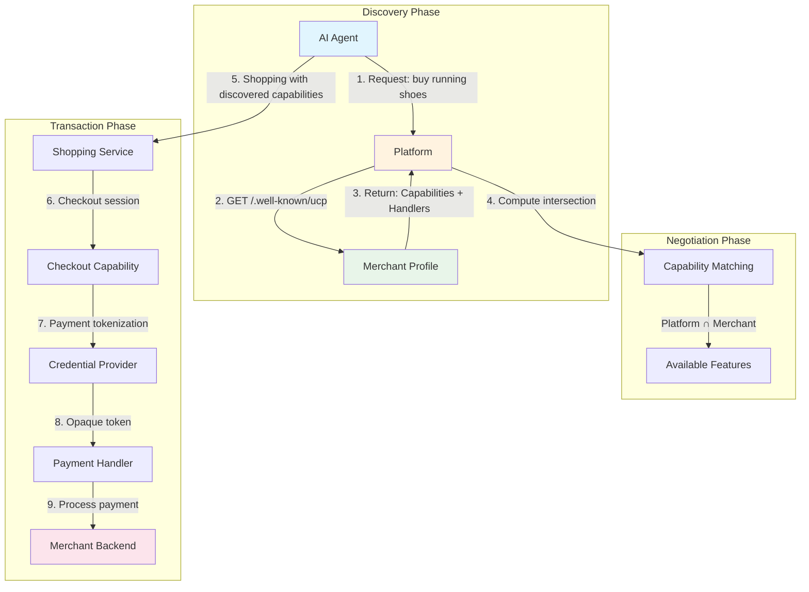
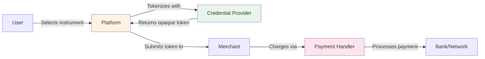
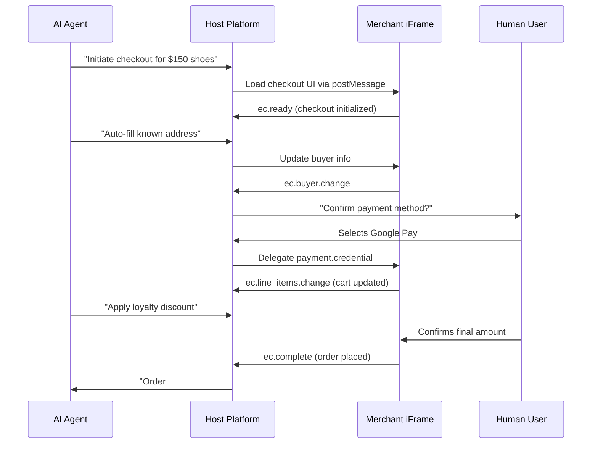

# UCP (Universal Commerce Protocol) 技术洞察

## 一句话定位

UCP 是 Google 主导、Shopify 深度参与的开放标准协议，通过**"服务器选择 + 能力协商"**架构，将 AI 商务从 N×N 的集成噩梦简化为统一抽象层，让任何 AI Agent 都能以标准化方式发现、协商并完成跨平台交易。

---

## 架构全景



**架构核心洞察**：UCP 不是传统意义上的"客户端调用服务端"协议，而是一个**"服务器选择协议（Server-Select Protocol）"**。平台（Platform）根据商家的能力声明（Profile），动态选择并协商出双方都能理解的交互方式。

---

## 核心机制详解

### 机制一：反向域名命名空间与能力发现

**问题是什么**：
传统电商集成中，每个商家都有独特的 API 端点、认证方式和数据格式。一个 AI Agent 要对接 100 个商家，就需要 100 种不同的集成代码，形成 N×N 的复杂度爆炸。

**关键洞察**：
与其让平台适配每个商家，不如让商家声明自己的能力，平台自动发现并协商交互方式。这类似于 DNS 的反向解析——通过标准化的"能力目录"定位服务。

**具体实现**：

1. **Well-Known Endpoint**：
   商家在 `https://merchant.com/.well-known/ucp` 托管 JSON Profile 文件

2. **Profile 结构**：
   ```json
   {
     "namespace": "com.example.merchant",
     "services": [{
       "id": "shopping",
       "capabilities": [{
         "id": "checkout",
         "version": "2025-01-15",
         "handlers": {
           "payment": ["google_pay", "stripe"],
           "shipping": ["fedex", "ups"]
         }
       }]
     }],
     "extensions": [{
       "id": "loyalty_program",
       "schema": "https://.../loyalty-schema.json"
     }]
   }
   ```

3. **能力协商算法**：
   ```
   Available = Platform_Capabilities ∩ Merchant_Capabilities
   
   例如：
   Platform:  [checkout, inventory, shipping, returns]
   Merchant:  [checkout, inventory, custom_tax]
   ─────────────────────────────────────────────
   Available: [checkout, inventory]
   ```

**为什么这样设计能 work**：
- **解耦**：商家无需知道平台的具体实现，只需声明"我能做什么"
- **版本兼容**：通过日期版本号（`2025-01-15`），支持多版本共存
- **动态扩展**：新能力通过 Extensions 机制添加，不影响核心协议

---

### 机制二：支付工具与处理程序解耦

**问题是什么**：
支付是商务的核心，但支付方式的多样性（信用卡、数字钱包、加密货币）和支付处理商的异构性（Stripe、Adyen、PayPal）让集成变得异常复杂。

**关键洞察**：
将"支付工具（Instrument）"与"支付处理程序（Handler）"解耦。用户选择用什么付（工具），商家选择通过谁处理（处理程序），两者通过标准化令牌间接通信。

**具体实现**：

**信任三角架构**：


**三阶段支付流程**：

1. **Advertisement（声明）**：
   商家在 Profile 中声明支持的支付方式
   ```json
   {
     "handlers": {
       "payment": {
         "type": "tokenized",
         "providers": ["stripe", "adyen"],
         "networks": ["visa", "mastercard", "amex"]
       }
     }
   }
   ```

2. **Acquisition（获取）**：
   平台直接与凭证提供商（Google Pay、Apple Pay）交互，获取加密令牌
   - 商家**从未接触**原始 PAN（主账号）
   - 平台可选择仅处理令牌，不触碰敏感数据

3. **Completion（完成）**：
   商家后端使用令牌向支付处理商发起扣款
   ```python
   # 商家后端代码示例（概念性）
   def process_payment(ucp_token, amount):
       # ucp_token 是平台提供的不透明令牌
       # 商家无法解密，只能传递给支付网关
       response = stripe.charges.create(
           source=ucp_token,
           amount=amount,
           currency='usd'
       )
       return response.status
   ```

**为什么这样设计能 work**：
- **PCI 范围最小化**：商家不存储、不处理原始卡号，大幅降低合规成本
- **灵活性**：用户可用任何支持的支付方式，商家只需对接标准化接口
- **安全性**：信任三角确保任何一方都无法单独完成欺诈交易

---

### 机制三：嵌入式结账协议（ECP）与人机协作

**问题是什么**：
完全自主的 AI 购物存在信任问题——用户可能不放心 AI 独立完成大额交易，需要在关键环节人工确认。

**关键洞察**：
设计一个"可嵌入的结账界面"，让 AI 和人类在交易流程中无缝协作。AI 负责信息收集和预处理，人类负责关键决策确认。

**具体实现**：

**ECP 架构**：


**关键设计细节**：

1. **JSON-RPC 2.0 over postMessage**：
   Host（平台）与 Merchant（商家 iframe）通过标准化消息协议通信

2. **任务委托机制**：
   Host 可以委托特定任务给 Merchant，如：
   - `payment.credential`：选择支付方式
   - `shipping.address`：选择配送地址
   - `buyer.email`：输入联系信息

3. **状态同步**：
   Merchant 通过通知机制同步状态变化：
   - `ec.start`：结账界面可见
   - `ec.line_items.change`：购物车变更
   - `ec.complete`：订单完成
   - `ec.message.change`：错误/警告

**为什么这样设计能 work**：
- **渐进式信任**：用户可以从"完全手动"逐步过渡到"完全自动"
- **商家控制**：商家保持"记录商家（Merchant of Record）"身份，控制品牌体验
- **平台无关**：ECP 协议不绑定特定平台，任何 Host 都可以实现

---

## 关键设计决策

### 决策一：反向域名命名空间 vs 中心化注册表

**选择了什么**：
UCP 使用反向域名（`com.example.merchant`）作为命名空间，商家自主托管 Profile 文件。

**显而易见的替代方案**：
像 ACP 那样建立中心化注册表（OpenAI Catalog），商家向平台注册。

**为什么没选**：
- **去中心化**：避免单一平台控制整个生态
- **自主权**：商家完全控制自己的商务逻辑和数据
- **可扩展性**：无需平台审核，新商家可以立即接入

**Trade-off**：
- 发现机制更复杂（需要爬虫或索引服务）
- 商家需要自行维护 Profile 文件的可访问性

---

### 决策二：能力协商 vs 固定 API 契约

**选择了什么**：
动态能力协商——平台与商家在每次交互前计算能力交集。

**显而易见的替代方案**：
像 REST API 那样定义固定的端点和请求/响应格式。

**为什么没选**：
- **灵活性**：商家可以只实现部分能力，平台自适应
- **版本管理**：通过协商自动处理版本兼容性
- **扩展性**：新能力通过 Extensions 添加，不破坏现有集成

**Trade-off**：
- 首次交互有协商开销
- 调试复杂度增加（需要理解协商逻辑）

---

### 决策三：传输层无关 vs 绑定特定协议

**选择了什么**：
UCP 设计为传输层不可知，支持 REST、MCP、A2A 等多种传输方式。

**显而易见的替代方案**：
像 gRPC 或 GraphQL 那样绑定特定传输协议。

**为什么没选**：
- **生态兼容**：可以嵌入现有技术栈（如 MCP 工具调用）
- **未来证明**：新传输协议出现时无需重构核心逻辑
- **场景适配**：不同场景选择最适合的传输（REST 用于同步，A2A 用于 Agent 协作）

**Trade-off**：
- 需要为每种传输实现适配层
- 某些传输特性可能无法充分利用

---

## 技术栈与依赖

| 层级 | 技术/标准 | 用途 |
|------|-----------|------|
| **传输** | REST / HTTP/2 / MCP / A2A | 多协议支持 |
| **序列化** | JSON / JSON-RPC 2.0 | 消息格式 |
| **Schema** | JSON Schema | 能力定义与验证 |
| **安全** | OAuth 2.0 / JWT / Verifiable Credentials | 认证与授权 |
| **支付** | Tokenization / PCI DSS | 支付安全 |
| **发现** | Well-Known URI (RFC 8615) | 服务发现 |

---

## 批判性分析

### 维度一：架构哲学

UCP 的设计体现了鲜明的**"去中心化、开放生态"**工程价值观：

- **与 ACP 的对比**：
  - ACP 是"平台控制"模式——OpenAI 维护商家目录，商家向平台注册
  - UCP 是"商家自主"模式——商家托管自己的 Profile，平台被动发现

- **与 Web 的类比**：
  - ACP 像 App Store（中心化审核、平台控制）
  - UCP 像 Web（开放发布、自主托管）

**潜在风险**：
- 去中心化导致质量参差不齐，需要额外的信誉/审核机制
- 商家技术门槛较高（需要自行实现 UCP Server）

---

### 维度二：业界认可度

**当前状态**（截至 2026-03）：

- **GitHub**: [UCP Samples](https://github.com/Universal-Commerce-Protocol/samples) 仓库，Apache-2.0 协议
- **主要参与者**：Google（主导）、Shopify（深度参与）、Stripe、Adyen（支付支持）
- **采用情况**：
  - Google AI Mode（已集成）
  - Shopify Checkout Kit（官方支持）
  - 多个商家开始实验性接入

**与 ACP 的竞争态势**：
- UCP 生态更开放，但 ACP 有 OpenAI 的流量优势
- 两者可能长期共存，服务于不同场景

---

## 关键收获

1. **"服务器选择"是核心创新**：UCP 不是传统客户端-服务端协议，而是平台根据商家能力动态选择交互方式的"反向"协议。这种设计从根本上解决了 N×N 集成问题。

2. **信任三角实现支付安全**：通过将支付工具、平台、商家解耦，UCP 在保持灵活性的同时实现了 PCI 合规的最小化。这是工程安全与实用性的优秀平衡。

3. **ECP 定义了人机协作新标准**：嵌入式结账协议不是简单的 iframe 嵌入，而是一套完整的状态同步和任务委托机制。这为"AI 辅助但人类决策"的交互模式提供了技术基础。

---

## 参考资源

- [UCP 官方网站](https://ucp.dev/)
- [UCP 规范文档](https://ucp.dev/specification/)
- [Google Merchant UCP 指南](https://developers.google.com/merchant/ucp)
- [Shopify UCP 工程博客](https://shopify.engineering/ucp)
- [UCP GitHub Samples](https://github.com/Universal-Commerce-Protocol/samples)
- [Google Developers Blog: Under the Hood](https://developers.googleblog.com/under-the-hood-universal-commerce-protocol-ucp/)
